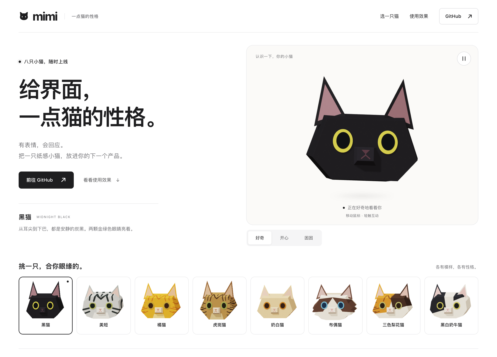
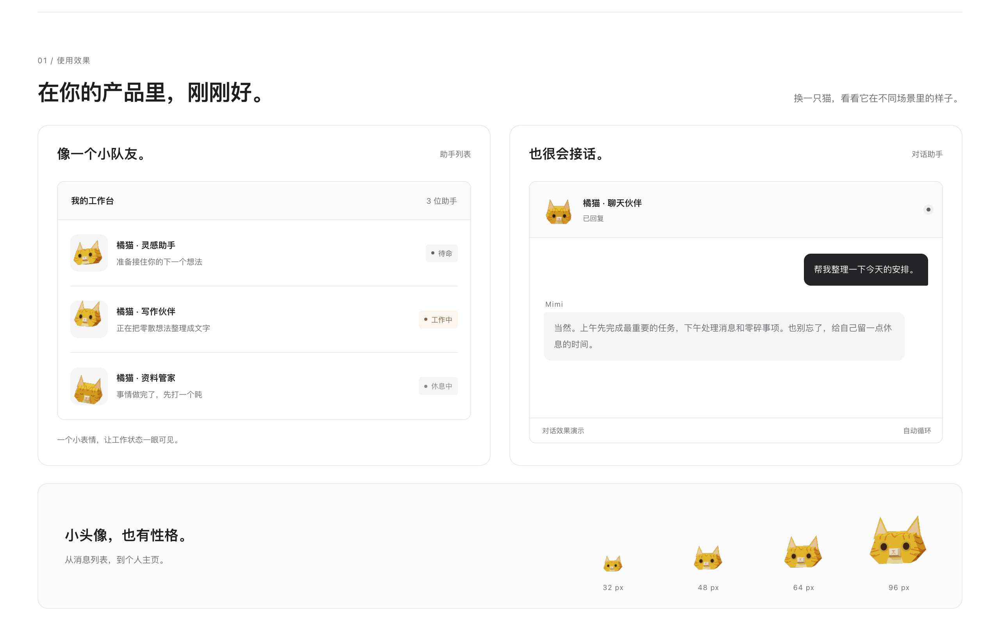

<div align="center">

# Mimi

**给界面，一点猫的性格。**

八只纸感猫咪头像，纯代码绘制，支持 JavaScript 与 React。

[快速开始](#快速开始) · [接入文档](DISTRIBUTION.md) · [部署指南](DEPLOYMENT.md)

<a href="docs/images/mimi-overview.png">
  
</a>

</div>

## 小头像，也有性格

- **8 种固定造型**：黑猫、美短、橘猫、虎斑猫、奶白猫、布偶猫、三色梨花猫、黑白奶牛猫。
- **3 种动态状态**：好奇、工作、困困，支持指针跟随与轻触回应。
- **直接接入**：原生 JavaScript、React 组件、TypeScript 类型，也可用本地函数导出透明 PNG。

<p align="center">
  <a href="docs/images/mimi-in-action.png">
    
  </a>
</p>

## 快速开始

```sh
git clone https://github.com/verycafe/MIMI.git
cd MIMI
python3 -m http.server 8765 --bind 127.0.0.1
```

打开 [localhost:8765/mimi.html](http://localhost:8765/mimi.html)。仓库已包含可运行页面，无需先安装依赖。

### JavaScript

```html
<div id="cat"></div>
<script src="./dist/mimi-cat-avatars.js"></script>
<script>
  const avatar = MimiAvatars.createAvatar(
    document.querySelector('#cat'),
    { cat: 'black', state: 'default', size: 96 }
  );

  avatar.update({ state: 'working' });
  // 移除组件时调用 avatar.destroy()
</script>
```

[React 示例](examples/react-example.jsx) · [完整接入方法](DISTRIBUTION.md)

头像在浏览器本地运行，无需服务器或 API Key。需要支持 WebGL 2 的浏览器；React 组件需 React 18+。聊天窗口使用固定文案演示。

## 构建与部署

| 命令 | 用途 |
| --- | --- |
| `npm run build` | 更新 SDK、组件包与单文件页面，需 Node.js 和 Python 3 |
| `npm run build:site` | 生成 `site/`，仅包含部署用的网站文件 |

Cloudflare Workers 配置见 [部署指南](DEPLOYMENT.md)。静态资源目录使用 `site/`。

## 许可

[MIT](LICENSE)
